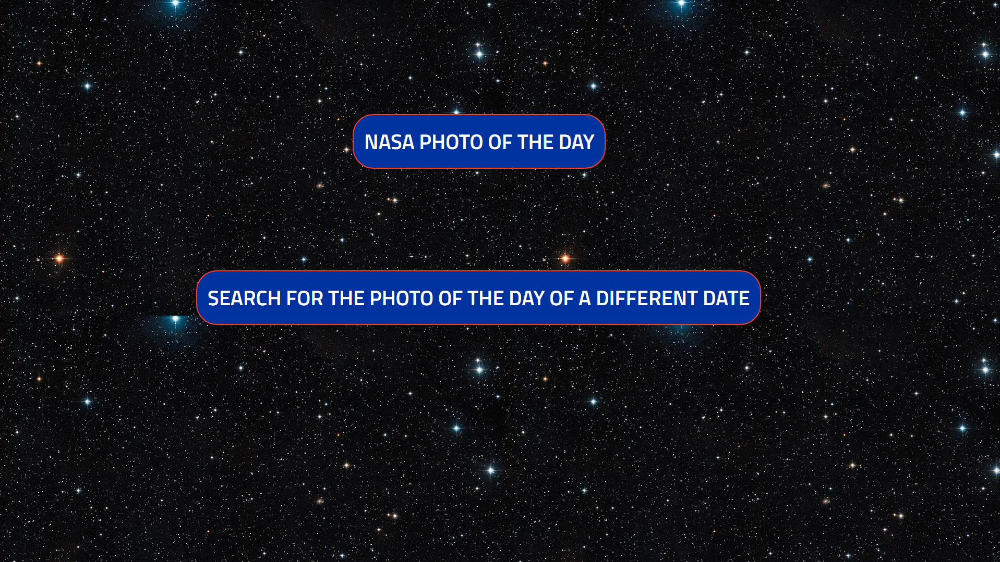

# Space Photo of the Day

## About The Project
This application gives users access to the Nasa photo of the day with the click of a button. Uses Nasa's Astronomy Photo of the Day API. User can also input any previous date and view the Astronomy Photo of the Day for that date



### Installation

1. Clone the repo
   ```sh
   git clone https://github.com/Ja-Bril/NasaApi.git
   ```


## Contact

Diego Abril -  - abrildiego96@gmail.com
Project Link: [https://github.com/Ja-Bril/NasaApi](https://github.com/Ja-Bril/NasaApi)


[React.js]: https://img.shields.io/badge/React-20232A?style=for-the-badge&logo=react&logoColor=61DAFB
[React-url]: https://reactjs.org/
Project Link: [https://github.com/Ja-Bril/NasaApi]

